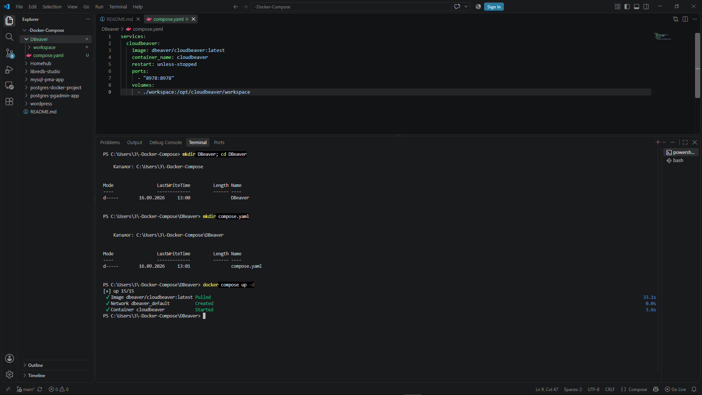
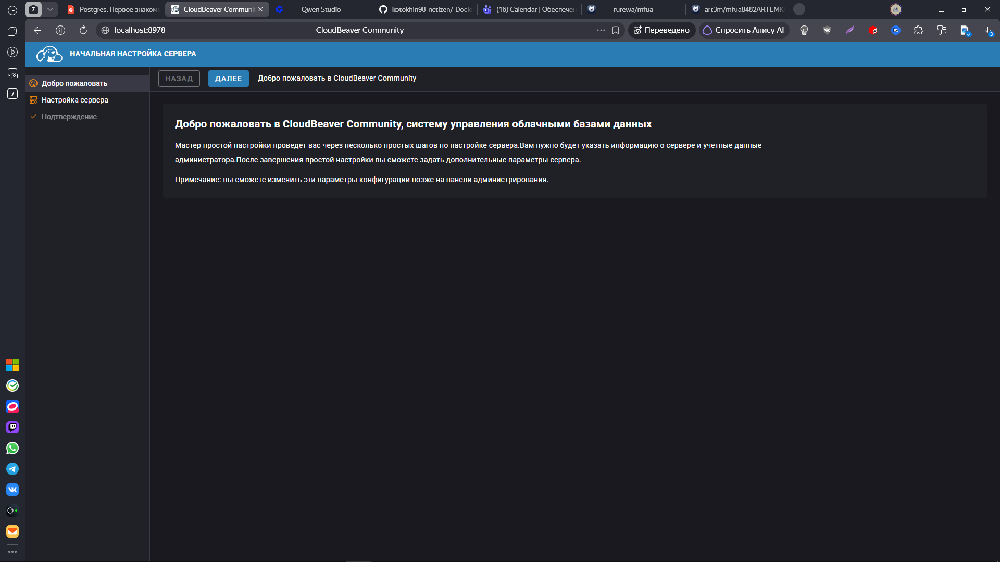
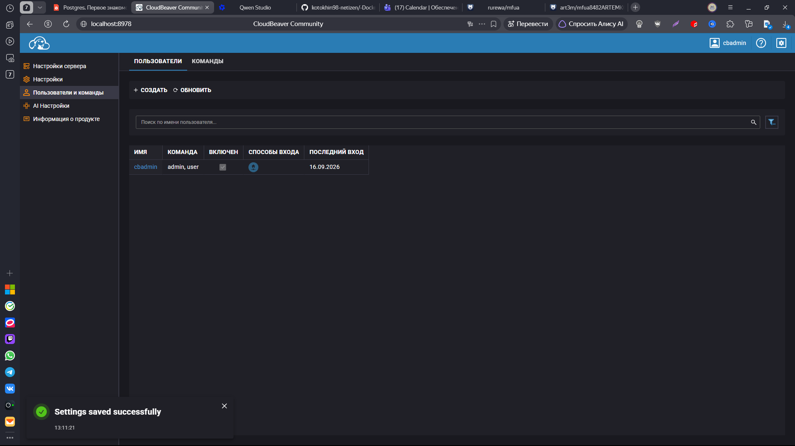

```markdown
# CloudBeaver (DBeaver Web)

**CloudBeaver** — это веб-версия популярного desktop-инструмента **DBeaver**. Она позволяет управлять базами данных через браузер, сохраняя все возможности оригинального клиента.

Данное руководство поможет быстро развернуть CloudBeaver с помощью Docker Compose.

## 🚀 Быстрый старт

### 1. Подготовка окружения

Создайте отдельный каталог для проекта и перейдите в него:

```shell
mkdir DBeaver && cd DBeaver
```

### 2. Конфигурация

Создайте в каталоге `DBeaver` файл `compose.yaml` со следующим содержимым:

```yaml
services:
  cloudbeaver:
    image: dbeaver/cloudbeaver:latest
    container_name: cloudbeaver
    restart: unless-stopped
    ports:
      - "8978:8978"
    volumes:
      - ./workspace:/opt/cloudbeaver/workspace
```

> **Примечание:** Том `./workspace` монтируется для сохранения всех подключений, настроек и скриптов. Данные не пропадут при перезапуске контейнера.

### 3. Запуск сервиса

Загрузите образы, создайте контейнеры и запустите сервис в фоновом режиме:

```shell
docker compose up -d
```

### 4. Первоначальная настройка

1. Откройте браузер и перейдите по адресу: [http://localhost:8978](http://localhost:8978)
2. При первом входе система попросит создать администратора.
   - **Имя пользователя:** `cbadmin`
   - **Пароль:** должен быть длиннее 8 символов и содержать как минимум одну прописную и одну строчную букву.

---

## 🛠 Управление проектом

Все команды выполняются из директории, где находится файл `compose.yaml`.

### Состояние контейнеров

Показать только запущенные сервисы:
```shell
docker compose ps
```

Показать все сервисы (включая остановленные):
```shell
docker compose ps -a
```

### Просмотр логов

Вывести логи сервиса:
```shell
docker compose logs cloudbeaver
```

Следить за логами в реальном времени (рекомендуется запускать в отдельном окне терминала):
```shell
docker compose logs -f cloudbeaver
```

### Управление жизненным циклом

| Действие | Команда |
| :--- | :--- |
| **Остановить** сервис | `docker compose stop` |
| **Запустить** остановленный сервис | `docker compose start` |
| **Перезапустить** сервис | `docker compose restart` |
| Показать текущую конфигурацию | `docker compose config` |





### Вход в контейнер (Exec)

Если требуется выполнить команды внутри контейнера (например, для отладки):

1. Узнайте имя контейнера (обычно `cloudbeaver`):
   ```shell
   docker compose ps
   ```
2. Выполните вход в оболочку bash:
   ```shell
   docker compose exec cloudbeaver bash
   ```
   *(Примечание: в исходной инструкции был указан `mysql`, но для образа CloudBeaver правильным именем сервиса является `cloudbeaver`)*.

3. Чтобы выйти из оболочки контейнера, введите:
   ```shell
   exit
   ```




---

## 🗑 Удаление проекта

Если вы хотите полностью удалить развертывание, следуйте этим шагам.

> ⚠️ **Внимание:** Команда с флагом `-v` удалит все данные без возможности восстановления!

1. **Остановка и удаление контейнеров** (данные в томах сохранятся):
   ```shell
   docker compose down
   ```

2. **Полное удаление** (контейнеры + тома с данными + сети):
   ```shell
   docker compose down -v
   ```

3. **Удаление образа** (опционально, чтобы освободить место):
   ```shell
   docker image rm dbeaver/cloudbeaver:latest
   ```

4. **Удаление файлов проекта**:
   
   Выйдите из папки проекта:
   ```shell
   cd ..
   ```
   
   Удалите директорию:
   ```shell
   rm -rf DBeaver
   ```
   *(В Linux может потребоваться использование `sudo`)*.

---

## 🔗 Полезные ссылки

* [Официальный сайт DBeaver](https://dbeaver.io/)
* [Документация CloudBeaver](https://github.com/dbeaver/cloudbeaver/wiki)
* [Docker Hub: dbeaver/cloudbeaver](https://hub.docker.com/r/dbeaver/cloudbeaver)

---

> 💡 **Нашли ошибку?** Если вы обнаружили неточность в этом руководстве, пожалуйста, сообщите автору!
```
