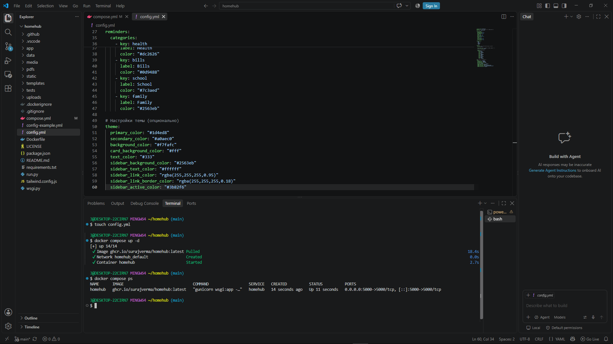
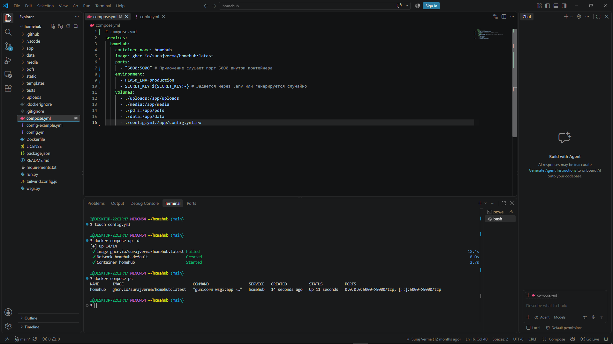
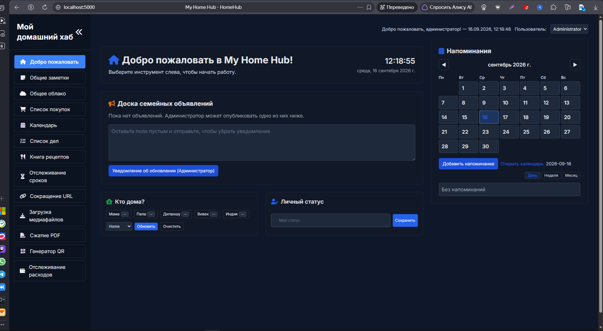

***

# HomeHub: Семейная панель управления

**HomeHub** — это универсальная, легковесная веб-панель для организации быта всей семьи. Разместите её на собственном сервере (идеально подходит для **Raspberry Pi**) и получите приватное пространство для общих задач.

### 🚀 Возможности
*   📝 Общие заметки и списки дел
*   🛒 Списки покупок
*   💰 Отслеживание семейных расходов
*   📂 Загрузка и хранение медиафайлов
*   📄 Компрессия PDF
*   🔗 Генератор QR-кодов и сокращатель ссылок
*   🍳 Рецепты и трекер сроков годности продуктов
*   🏠 Статус "Кто дома" и напоминания

> [Ссылка на оригинальный репозиторий Homehub](https://github.com/surajverma/homehub)

---

## 📋 Инструкция по установке

### 1. Подготовка окружения

Склонируйте репозиторий приложения:

```bash
git clone https://github.com/surajverma/homehub.git
```

Перейдите в папку проекта и создайте пустой файл конфигурации:

```bash
cd homehub && touch config.yml
```

### 2. Настройка Docker Compose

Откройте файл `compose.yml` (он уже существует в репозитории) и **замените** его содержимое на следующее:

```yaml
# compose.yml
services:
  homehub:
    container_name: homehub
    image: ghcr.io/surajverma/homehub:latest
    ports:
      - "5000:5000" # Приложение слушает порт 5000 внутри контейнера
    environment:
      - FLASK_ENV=production
      - SECRET_KEY=${SECRET_KEY:-} # Задается через .env или генерируется случайно
    volumes:
      - ./uploads:/app/uploads
      - ./media:/app/media
      - ./pdfs:/app/pdfs
      - ./data:/app/data
      - ./config.yml:/app/config.yml:ro
```

### 3. Конфигурация приложения (`config.yml`)

Откройте созданный ранее файл `config.yml` и вставьте следующую конфигурацию. Вы можете изменить имена членов семьи, цвета темы и включенные функции под свои нужды.

```yaml
instance_name: "My Home Hub"
password: "" # Оставьте пустым для доступа без пароля
admin_name: "Administrator"

feature_toggles:
  shopping_list: true
  media_downloader: true
  pdf_compressor: true
  qr_generator: true
  notes: true
  shared_cloud: true
  who_is_home: true
  personal_status: true
  chores: true
  recipes: true
  expiry_tracker: true
  url_shortener: true
  expense_tracker: true

family_members:
  - Mom
  - Dad
  - Dipanshu
  - Vivek
  - India

reminders:
  # Формат времени: "12h" (по умолчанию) или "24h"
  time_format: 12h
  
  # День начала недели в календаре: sunday, monday и т.д.
  calendar_start_day: monday 

  # Категории напоминаний
  categories:
    - key: health
      label: Health
      color: "#dc2626"
    - key: bills
      label: Bills
      color: "#0d9488"
    - key: school
      label: School
      color: "#7c3aed"
    - key: family
      label: Family
      color: "#2563eb"

# Настройки темы (опционально)
theme:
  primary_color: "#1d4ed8"
  secondary_color: "#a0aec0"
  background_color: "#f7fafc"
  card_background_color: "#fff"
  text_color: "#333"
  sidebar_background_color: "#2563eb"
  sidebar_text_color: "#ffffff"
  sidebar_link_color: "rgba(255,255,255,0.95)"
  sidebar_link_border_color: "rgba(255,255,255,0.18)"
  sidebar_active_color: "#3b82f6"
```




### 4. Запуск проекта

Находясь в корневой папке `homehub`, запустите контейнер в фоновом режиме:

```bash
docker compose up -d
```

> ⏳ **Примечание:** Приложению может потребоваться несколько минут для первого запуска. Пожалуйста, подождите перед открытием в браузере.

#### Проверка работоспособности

1.  **Проверить статус контейнера:**
    ```bash
    docker compose ps
    ```

2.  **Просмотр логов (в реальном времени):**
    ```bash
    docker compose logs -f
    ```
    *(Для выхода из режима логов нажмите `Ctrl+C`)*

3.  **Открыть приложение:**
    Перейдите в браузере по адресу: [http://localhost:5000](http://localhost:5000)



---

## 🗑️ Удаление проекта

Если вы хотите полностью удалить HomeHub и все связанные данные, используйте один из следующих способов.

### Способ 1: Полная очистка (Рекомендуемый)

Эта команда остановит контейнер, удалит тома с данными и образы.

```bash
docker compose down --rmi all -v
```

Затем удалите папку проекта:

```bash
cd ..
rm -rf homehub
```

### Способ 2: Пошаговое удаление

1.  Остановить контейнер и удалить тома:
    ```bash
    docker compose down -v
    ```
2.  Проверить, что контейнеры остановлены:
    ```bash
    docker ps -a
    # или
    docker compose ps -a
    ```
3.  Найти ID образа:
    ```bash
    docker images
    ```
4.  Удалить образ вручную (замените `id-образа` на реальный ID):
    ```bash
    docker rmi id-образа
    ```
5.  Выйти из директории и удалить файлы:
    ```bash
    cd ..
    rm -rf homehub
    ```

---

> ❗ **Нашли ошибку?** Если вы обнаружили неточность в этой инструкции, пожалуйста, сообщите автору!
