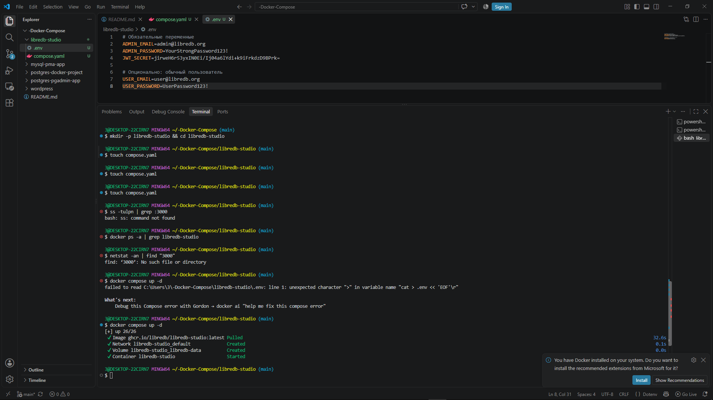
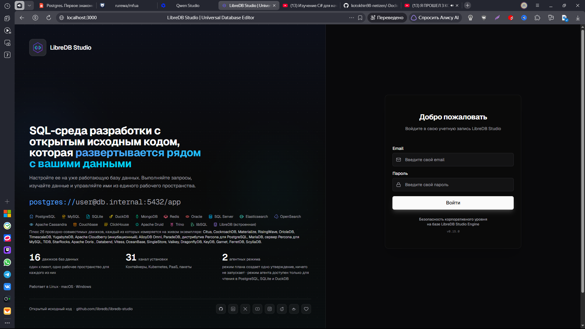
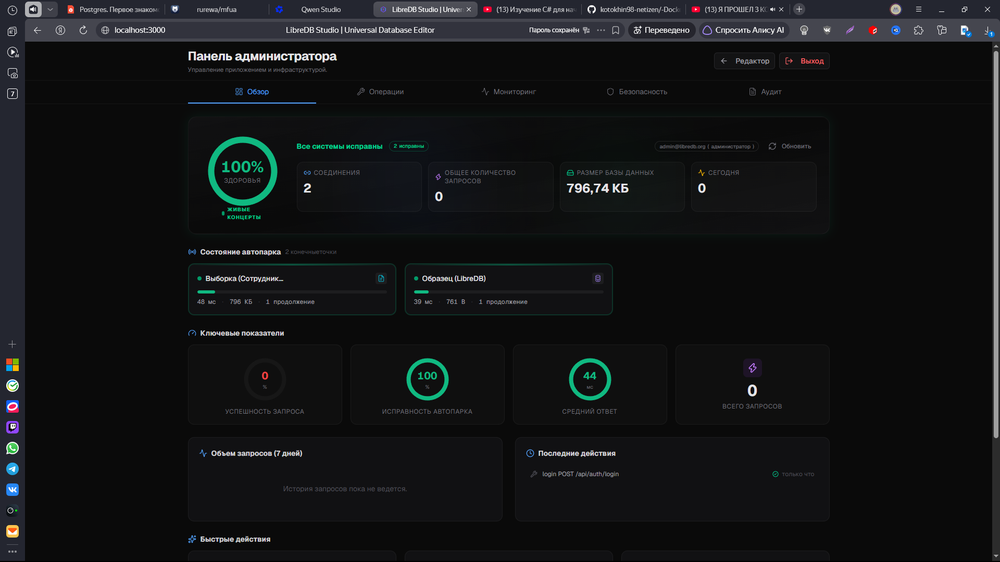

Вот готовый, красиво оформленный файл `README.md` на основе вашего текста. Я добавил структуру, подсветку синтаксиса, предупреждения и таблицы для лучшей читаемости.

Вы можете скопировать этот код и сохранить его как `README.md` в корне вашего репозитория или проекта.

***

```markdown
# LibreDB Studio

**LibreDB Studio** — это открытая (лицензия MIT) веб-IDE для работы с базами данных. Приложение разворачивается как Docker-контейнер непосредственно рядом с базой данных (на сервере или в облаке), а не на локальной машине разработчика.

По сути, это «браузерный аналог DataGrip/DBeaver» — единая точка входа для выполнения запросов, визуализации данных и администрирования.

### Преимущества
*   **Централизация:** Вместо установки десктопных приложений и поиска строк подключения каждым разработчиком, вы разворачиваете один контейнер на сервере.
*   **Доступность:** Пользователи заходят через браузер с любого устройства (включая мобильные), что критически важно для оперативного решения задач («горящих» запросов).
*   **Безопасность:** Доступ контролируется через единую точку входа с авторизацией.

---

## 📋 Предварительные требования

Перед началом работы убедитесь, что у вас установлен **Docker** и **Docker Compose**.

Проверьте другие запущенные приложения, чтобы избежать конфликтов портов:
```bash
docker compose ls
```

## 🚀 Быстрый старт

### 1. Создание каталога проекта

Создайте директорию и перейдите в нее:

```bash
mkdir -p libredb-studio && cd libredb-studio
```

Структура проекта будет следующей:
```text
libredb-studio/
├── compose.yaml
└── .env
```

### 2. Конфигурация Docker Compose

Создайте файл `compose.yaml`:

```bash
touch compose.yaml
```

Добавьте в него следующее содержимое:

```yaml
services:
  libredb-studio:
    image: ghcr.io/libredb/libredb-studio:latest
    container_name: libredb-studio
    ports:
      - "3000:3000"
    environment:
      # Email администратора
      ADMIN_EMAIL: ${ADMIN_EMAIL:-admin@libredb.org}
      # Пароль администратора (обязательно задайте в .env)
      ADMIN_PASSWORD: ${ADMIN_PASSWORD:?set ADMIN_PASSWORD in .env}
      # Секретный ключ для JWT (минимум 32 символа, обязательно задайте в .env)
      JWT_SECRET: ${JWT_SECRET:?set JWT_SECRET in .env (min 32 chars)}
      # Провайдер хранения конфигурации
      STORAGE_PROVIDER: sqlite
      STORAGE_SQLITE_PATH: /app/data/libredb-storage.db
    volumes:
      - libredb-data:/app/data
    restart: unless-stopped
    healthcheck:
      test: ["CMD", "wget", "--spider", "-q", "http://localhost:3000"]
      interval: 30s
      timeout: 10s
      retries: 3
      start_period: 40s

volumes:
  libredb-data:
```

### 3. Настройка переменных окружения (.env)

Создайте файл `.env` для хранения секретов. **Не коммитьте этот файл в публичные репозитории!**

```bash
cat > .env << 'EOF'
# Обязательные переменные
ADMIN_EMAIL=admin@libredb.org
ADMIN_PASSWORD=YourStrongPassword123!
JWT_SECRET=jirweH6r53yxlN0Ei/IjO4a6lYdi+k9iFrkdzD9BPrk=

# Опционально: обычный пользователь
USER_EMAIL=user@libredb.org
USER_PASSWORD=UserPassword123!
EOF
```

> ⚠️ **Важно:** Замените `ADMIN_PASSWORD` и `JWT_SECRET` на свои уникальные значения. `JWT_SECRET` должен быть длиной не менее 32 символов.

### 4. Запуск сервиса
#### Проверка порта
Убедитесь, что порт `3000` свободен:
```bash
ss -tulpn | grep :3000
```

#### Проверка имени контейнера
Убедитесь, что контейнер с именем `libredb-studio` еще не существует:
```bash
docker ps -a | grep libredb-studio
```

#### Запуск
Находясь в директории `libredb-studio`, выполните:

```bash
docker compose up -d
```



### 5. Проверка статуса и логи

Проверьте, что сервис запустился:
```bash
docker compose ps -a
```

Просмотр последних 20 строк логов:
```bash
docker compose logs --tail=20 libredb-studio
```

Для просмотра логов в реальном времени (выйти через `Ctrl+C`):
```bash
docker compose logs -f
```

## 🔐 Вход в систему

Откройте браузер и перейдите по адресу:
👉 **[http://localhost:3000](http://localhost:3000)**

Используйте учетные данные из файла `.env`:

| Роль | Логин (Email) | Пароль |
| :--- | :--- | :--- |
| **Admin** | `admin@libredb.org` | `YourStrongPassword123!` |
| User | `user@libredb.org` | `UserPassword123!` |

*(Если вы изменили значения в `.env`, используйте их)*





## 🗑️ Удаление проекта

Если вам нужно полностью удалить приложение и данные:

1. **Остановить и удалить контейнеры + тома данных:**
   ```bash
   docker compose down -v
   ```

2. **Удалить образ:**
   ```bash
   docker image rm ghcr.io/libredb/libredb-studio:latest
   ```

3. **Проверить очистку:**
   ```bash
   docker ps -a | grep libredb-studio
   docker volume ls | grep libredb
   ```

4. **(Опционально) Полная очистка Docker (осторожно!):**
   Это удалит все неиспользуемые образы, контейнеры и сети.
   ```bash
   docker system prune -a --volumes
   ```

5. **Удалить файлы проекта:**
   ```bash
   cd ..
   rm -rf libredb-studio
   ```

## 🔗 Полезные ссылки

*   [LibreDB Studio - анонс новой версии (OpenNET)](https://www.opennet.ru/opennews/art.shtml?num=66216)
*   [GitHub Repository (предположительно)](https://github.com/libredb/libredb-studio) *(проверьте актуальную ссылку)*

---
> 💡 **Заметка:** Если вы обнаружили ошибку в этой инструкции, пожалуйста, сообщите автору или создайте Pull Request.
```