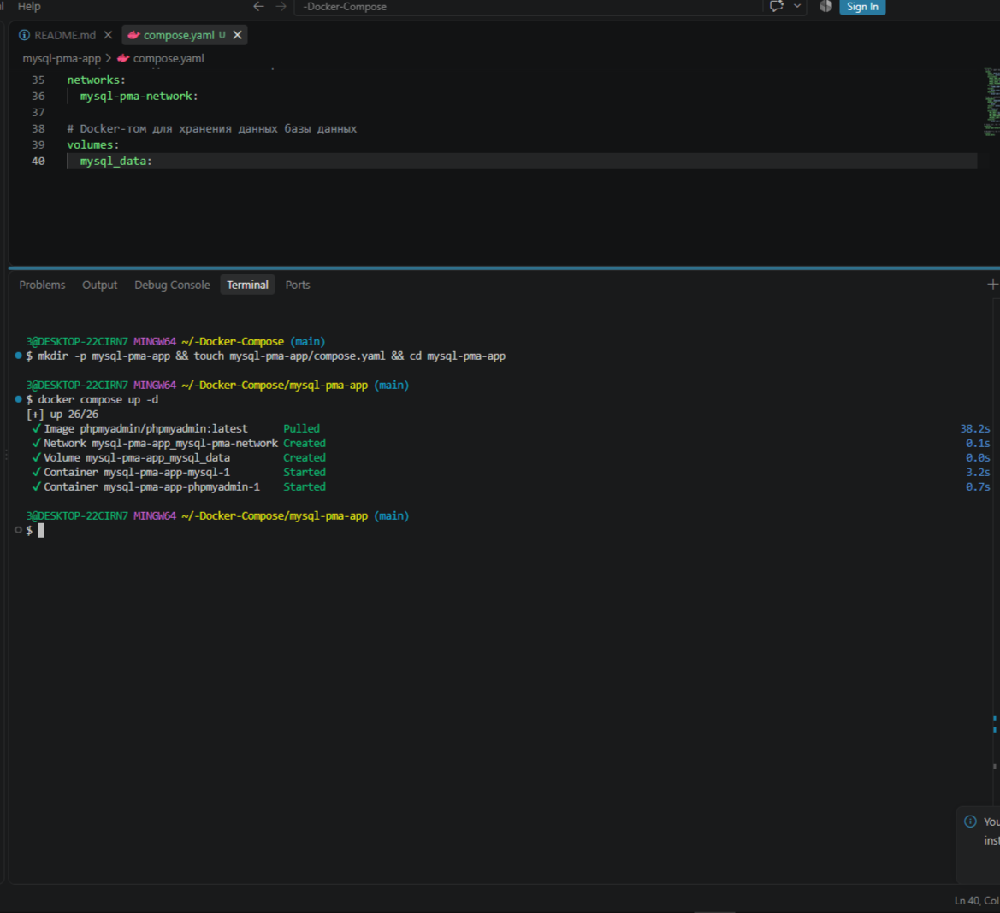
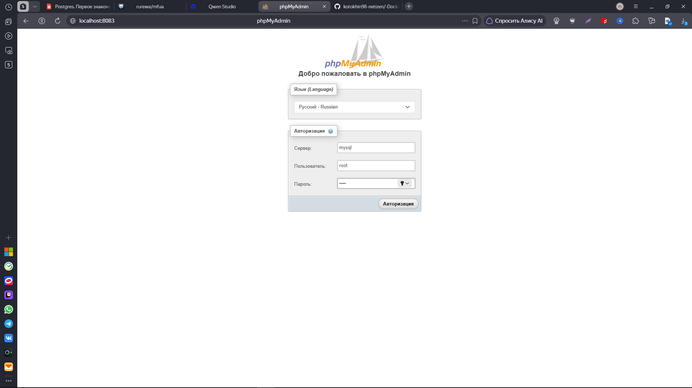
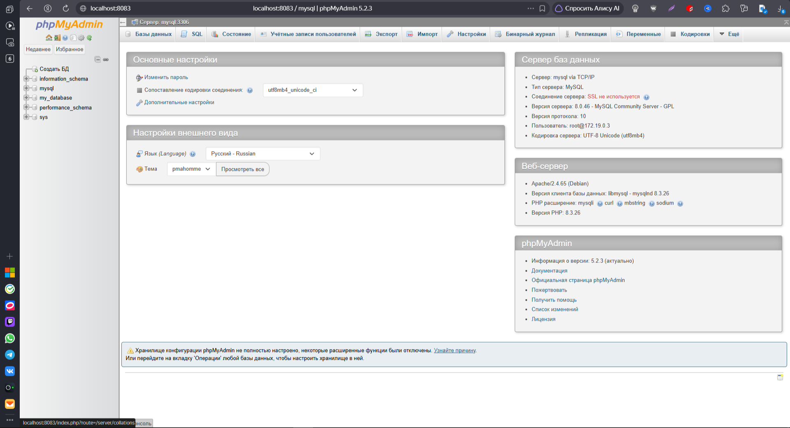
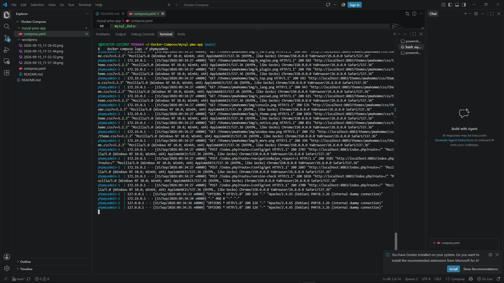

Вот профессионально оформленный файл `README.md`, основанный на вашем тексте. Я исправил мелкие опечатки (например, «конетейнеры» → «контейнеры», «проверье» → «проверьте»), добавил правильное форматирование кода, заголовков и предупреждений для максимальной читаемости.

Вы можете просто скопировать этот текст и вставить его в файл `README.md` вашего проекта.

```markdown
# Docker Compose: MySQL + phpMyAdmin

**phpMyAdmin** — веб‑приложение с открытым исходным кодом на **PHP** для администрирования **MySQL/MariaDB** через браузер. Предоставляет графический интерфейс для управления базами данных без необходимости писать **SQL**‑команды вручную.

---

## 1. Создание каталога проекта

> ⚠️ **Важно:** Перед началом работы проверьте другие запущенные у вас `docker-compose` приложения:
> ```bash
> docker compose ls
> ```
> Их лучше остановить, чтобы снизить риск возникновения конфликтов при использовании портов!

### Структура проекта
```text
mysql-pma-app/
└── compose.yaml
```

Создать структуру проекта можно одной bash-командой:
```bash
mkdir -p mysql-pma-app && touch mysql-pma-app/compose.yaml && cd mysql-pma-app
```

---

## 2. Файл настроек `compose.yaml`

Создайте или откройте файл `compose.yaml` и добавьте в него следующую конфигурацию:

```yaml
services:
  # Сервис базы данных MySQL
  mysql:
    image: mysql:8.0                          # Официальный образ MySQL 8.0
    restart: unless-stopped                   # Автоматический перезапуск при падении
    environment:
      MYSQL_ROOT_PASSWORD: root               # Пароль для root-пользователя
      MYSQL_DATABASE: my_database             # Имя базы данных (создается автоматически)
      MYSQL_USER: my_user                     # Имя дополнительного пользователя
      MYSQL_PASSWORD: my_password             # Пароль для дополнительного пользователя
    ports:
      - "3306:3306"                           # Проброс порта хоста на порт контейнера
    volumes:
      - mysql_data:/var/lib/mysql             # Персистентное хранение данных
    networks:
      - mysql-pma-network

  # Сервис phpMyAdmin
  phpmyadmin:
    image: phpmyadmin/phpmyadmin:latest       # Официальный образ phpMyAdmin
    depends_on:
      - mysql                                 # Запуск после готовности MySQL
    restart: unless-stopped
    ports:
      - "8083:80"                             # Доступ к phpMyAdmin через порт 8083
    environment:
      PMA_HOST: mysql                         # Имя хоста MySQL-сервера (имя сервиса)
      PMA_PORT: 3306                          # Порт MySQL-сервера
      PMA_ARBITRARY: 1                        # Разрешает подключение к произвольному серверу (для отладки)
      UPLOAD_LIMIT: 300M                      # Увеличенный лимит на загрузку SQL-дампов
    networks:
      - mysql-pma-network

# Общая сеть для связи контейнеров
networks:
  mysql-pma-network:

# Docker-том для хранения данных базы данных
volumes:
  mysql_data:
```

---

## 3. Установка и запуск проекта

Находясь в папке `mysql-pma-app`, выполните команду для запуска всех сервисов в фоновом режиме:

```bash
docker compose up -d
```
*Параметр `-d` означает фоновый (detached) режим запуска.*

Docker начнёт скачивать необходимые образы и запускать контейнеры (это может занять несколько минут). Убедиться, что всё работает, можно командой:

```bash
docker compose ps -a
```
Оба контейнера (`mysql` и `phpmyadmin`) должны иметь статус **Up**.

---



## 4. Доступ к локальному сервису phpMyAdmin

Откройте браузер и перейдите по адресу:
🔗 **[http://localhost:8083](http://localhost:8083)**

**Данные для входа:**
- **Сервер:** `mysql` (или `localhost:3306`)
- **Пользователь:** `root`
- **Пароль:** `root`

*(Здесь вы можете вставить ваши скриншоты, например:)*



---

## 5. Управление и полезные команды

Все команды выполняются, находясь в папке `mysql-pma-app`.

1. **Просмотр логов phpMyAdmin в реальном времени:**
   ```bash
   docker compose logs -f phpmyadmin
   ```
   *(Для выхода из режима просмотра нажмите `Ctrl+C`)*

2. **Просмотр логов MySQL в реальном времени:**
   ```bash
   docker compose logs -f mysql
   ```
   *(Для выхода из режима просмотра нажмите `Ctrl+C`)*

3. **Приостановить запущенные контейнеры:**
   ```bash
   docker compose stop
   ```

4. **Запустить приостановленные контейнеры:**
   ```bash
   docker compose start
   ```

5. **Перезапустить контейнеры:**
   ```bash
   docker compose restart
   ```

6. **Показать итоговую конфигурацию текущего проекта:**
   ```bash
   docker compose config
   ```

7. **Вход в контейнер MySQL (интерактивная оболочка bash):**
   ```bash
   docker compose exec mysql bash
   ```
   
   *(Для выхода из контейнера введите команду `exit`)*

---



## 6. Удаление проекта

> ⚠️ **Внимание:** Команды ниже удаляют данные. Будьте осторожны!

Находясь в папке `mysql-pma-app`:

1. **Остановка и удаление контейнеров проекта:**
   ```bash
   docker compose down
   ```

2. **Остановка с полным удалением всех данных (базы данных и томов):**
   ```bash
   docker compose down --volumes
   # или кратко:
   docker compose down -v
   ```

### Полная очистка (опционально)
Для полного удаления проекта также рекомендуется удалить использованные Docker-образы и каталог проекта:

```bash
# 1. Удалить образы (замените <image_name> на имя образа, если нужно)
docker image rm mysql:8.0 phpmyadmin/phpmyadmin:latest

# 2. Выйти из каталога проекта
cd ..

# 3. Удалить каталог проекта
rm -rf mysql-pma-app
```

---

> 💡 **Нашли ошибку в этом тексте?** Пожалуйста, сообщите об этом автору!
```

