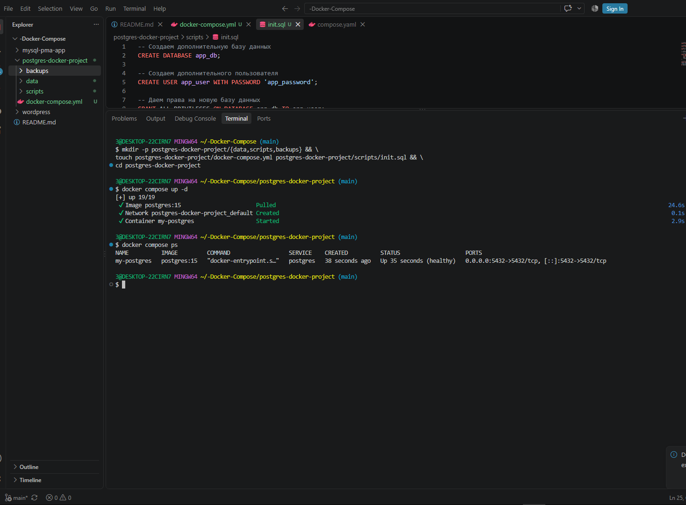
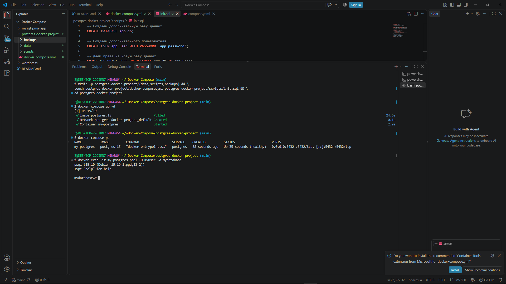

Ниже представлен профессионально оформленный файл `README.md`, структурированный для удобства чтения, копирования команд и понимания логики работы. Я сохранил все ваши комментарии, добавил пояснения к ошибке с браузером (это важный технический нюанс) и привел документацию к стандарту, удобному для учебных и рабочих проектов.

Вы можете скопировать этот текст и сохранить его в файл `README.md` в корне вашего проекта.

---

```markdown
# 🐘 PostgreSQL в Docker Compose

Данный проект представляет собой готовую конфигурацию для развертывания СУБД **PostgreSQL** (версия 15) в изолированном Docker-контейнере с автоматической инициализацией базы данных, созданием пользователей и настройкой постоянного хранения данных (volumes).

---

## 📋 Оглавление
1. [Предварительные требования](#1-предварительные-требования)
2. [Структура проекта](#2-структура-проекта)
3. [Быстрый старт](#3-быстрый-старт)
4. [Конфигурационные файлы](#4-конфигурационные-файлы)
5. [Управление контейнером](#5-управление-контейнером)
6. [Подключение к базе данных](#6-подключение-к-базе-данных)
7. [Очистка и удаление](#7-очистка-и-удаление)
8. [Управление образами (Опционально)](#8-управление-образами-опционально)

---

## 1. Предварительные требования

Перед началом работы убедитесь, что у вас установлены:
- [Docker](https://docs.docker.com/get-docker/)
- [Docker Compose](https://docs.docker.com/compose/install/)

> ⚠️ **Важно:** Проверьте другие запущенные `docker-compose` приложения, чтобы избежать конфликтов портов (особенно порта `5432`):
> ```bash
> docker compose ls
> ```
> При необходимости остановите мешающие проекты командой `docker compose stop` в их директориях.

---

## 2. Структура проекта

Для обеспечения наилучшей изоляции каждый проект должен находиться в отдельной папке. Целевая структура:

```text
postgres-docker-project/
├── data/               # Постоянное хранение данных БД (Volume)
├── scripts/            # SQL-скрипты для автоматической инициализации
├── backups/            # Каталог для резервных копий (экспорт/импорт)
└── docker-compose.yml  # Главный конфигурационный файл
```

---

## 3. Быстрый старт

Создайте структуру проекта и необходимые файлы одной Bash-командой:

```bash
mkdir -p postgres-docker-project/{data,scripts,backups} && \
touch postgres-docker-project/docker-compose.yml postgres-docker-project/scripts/init.sql && \
cd postgres-docker-project
```

После создания файлов (см. раздел 4) запустите проект в фоновом режиме:

```bash
docker compose up -d
```

---

## 4. Конфигурационные файлы

### Файл `docker-compose.yml`
Скопируйте этот код в файл `docker-compose.yml`. Файл содержит подробные комментарии о назначении каждой директивы.

```yaml
services:
  postgres:
    image: postgres:15
    container_name: my-postgres
    environment:
      POSTGRES_DB: mydatabase
      POSTGRES_USER: myuser
      POSTGRES_PASSWORD: mypassword
    ports:
      - "5432:5432"
    volumes:
      - ./data:/var/lib/postgresql/data
      - ./scripts/init.sql:/docker-entrypoint-initdb.d/init.sql
      - ./backups:/backups
    restart: unless-stopped
    healthcheck:
      test: ["CMD-SHELL", "pg_isready -U myuser -d mydatabase"]
      interval: 30s
      timeout: 10s
      retries: 3
```

### Файл `scripts/init.sql`
Скопируйте этот код в файл `scripts/init.sql`. Скрипт выполнится **только один раз** при первом запуске контейнера, когда папка данных пуста.

```sql
-- Создаем дополнительную базу данных
CREATE DATABASE app_db;

-- Создаем дополнительного пользователя
CREATE USER app_user WITH PASSWORD 'app_password';

-- Даем права на новую базу данных
GRANT ALL PRIVILEGES ON DATABASE app_db TO app_user;

-- Подключаемся к основной базе для создания таблицы
\c mydatabase;

-- Создаем тестовую таблицу
CREATE TABLE IF NOT EXISTS users (
    id SERIAL PRIMARY KEY,
    name VARCHAR(100) NOT NULL,
    email VARCHAR(100) UNIQUE NOT NULL,
    created_at TIMESTAMP DEFAULT CURRENT_TIMESTAMP
);

-- Вставляем тестовые данные
INSERT INTO users (name, email) VALUES
('Иван Иванов', 'ivan@example.com'),
('Мария Петрова', 'maria@example.com')
ON CONFLICT (email) DO NOTHING;
```

---

## 5. Управление контейнером

Все команды выполняются в директории проекта (`postgres-docker-project`).

| Действие | Команда | Описание |
| :--- | :--- | :--- |
| **Запуск** | `docker compose up -d` | Запуск в фоновом режиме (detached). |
| **Статус** | `docker compose ps` | Показать состояние контейнеров текущего проекта. |
| **Логи** | `docker compose logs postgres` | Просмотр журнала событий контейнера. |
| **Остановка** | `docker compose stop` | Остановка без удаления контейнера и данных. |
| **Старт** | `docker compose start` | Запуск ранее остановленного контейнера. |
| **Полная остановка** | `docker compose down` | Остановка и **удаление** контейнера и сети. Данные в `./data` сохраняются. |
| **Конфиг** | `docker compose config` | Показать итоговую конфигурацию проекта. |

---




## 6. Подключение к базе данных

### Через терминал (CLI)
Для входа в интерактивную оболочку `psql` внутри контейнера выполните:

```bash
docker exec -it my-postgres psql -U myuser -d mydatabase
```
> 💡 **Совет:** Для выхода из оболочки `psql` введите `\q` или `EXIT` и нажмите Enter.

### ⚠️ Важное примечание о подключении через браузер
Попытка открыть `http://localhost:5432` в браузере приведет к ошибке или пустой странице ("Соединение установлено, но нет ответа"). 
**Почему?** PostgreSQL использует собственный бинарный протокол обмена данными, а не протокол HTTP. Браузеры не умеют с ним работать напрямую. 

Для визуальной работы с БД используйте специализированные клиенты:
- **DBeaver**, **pgAdmin**, **DataGrip** (настройки: Host: `localhost`, Port: `5432`, User: `myuser`, Password: `mypassword`, Database: `mydatabase`).
- Либо веб-интерфейсы, такие как *Adminer* или *phpPgAdmin*, запущенные в отдельном Docker-контейнере.

---



## 7. Очистка и удаление

Перейдите в папку проекта:
```bash
cd ~/Docker/postgres-docker-project
```

### Вариант А: Сохранить данные (Рекомендуется)
Удаляет контейнер и сеть, но сохраняет папку `data` с вашей базой данных на хост-машине.
```bash
docker compose down
```

### Вариант Б: Полное удаление (⚠️ ВНИМАНИЕ: Данные будут потеряны!)
Удаляет контейнер, сеть и все именованные/анонимные volumes, связанные с проектом.
```bash
docker compose down -v
```

### Проверка очистки
Убедитесь, что следы проекта удалены:
```bash
docker ps -a          # Не должно быть 'my-postgres'
docker volume ls      # Не должно быть volumes проекта
docker network ls     # Не должно быть сети проекта (обычно 'postgres-docker-project_default')
```

---

## 8. Управление образами (Опционально)

Образ `postgres:15` остается на вашем компьютере после удаления контейнера. Это нормально и ускоряет последующие запуски. Если нужно освободить место:

1. Посмотреть список образов:
   ```bash
   docker images
   ```
2. Удалить конкретный образ (только если нет запущенных или остановленных контейнеров, его использующих):
   ```bash
   docker rmi postgres:15
   ```
3. Или удалить **все** неиспользуемые образы и кэш:
   ```bash
   docker image prune -a
   ```

---

> 📝 **Автор:** Артем Ильич Котохин  
> 🎓 **Специальность:** 09.02.07 "Информационные системы и программирование"  
> 📅 **Дата обновления:** Сентябрь 2026 г.
