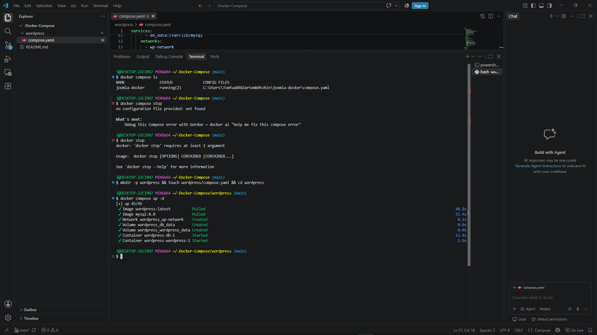
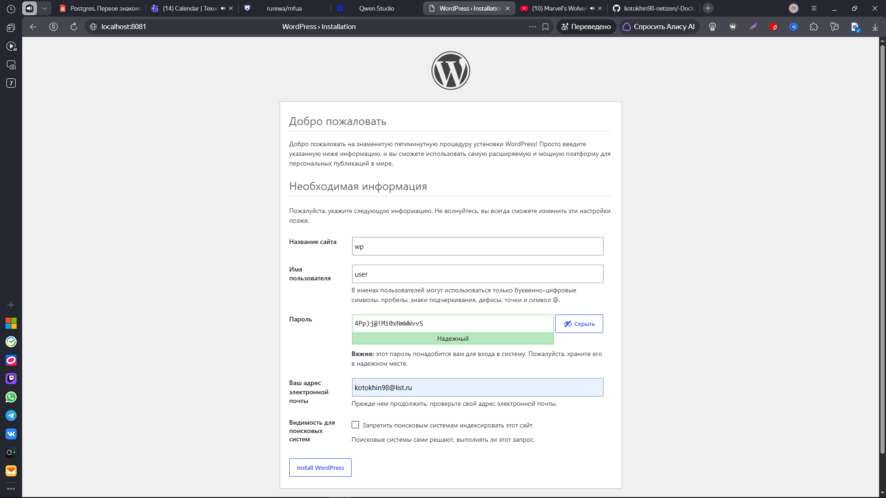
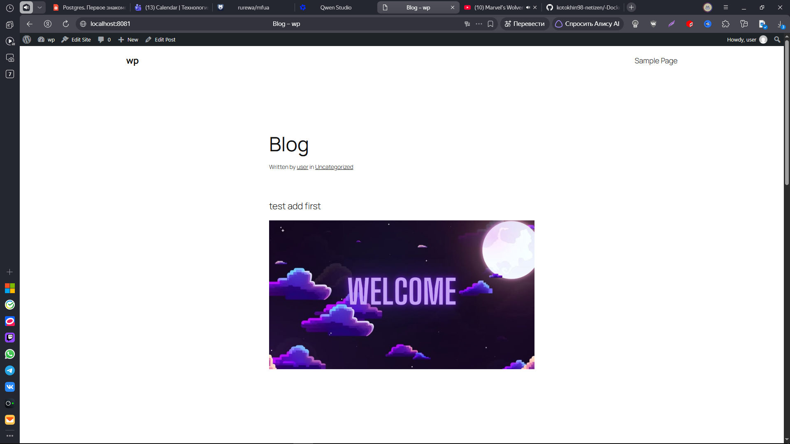

## 📋 Шаг 1: Проверка текущих контейнеров

Сначала проверьте, какие Docker Compose приложения уже запущены:

```bash
docker compose ls
```

Если есть работающие проекты, лучше их остановить:
```bash
docker compose stop
```

##  Шаг 2: Создание структуры проекта

Выполните команду для создания папки и файла:

```bash
mkdir -p wordpress && touch wordpress/compose.yaml && cd wordpress
```

##  Шаг 3: Создание файла compose.yaml

Откройте файл `compose.yaml` в текстовом редакторе и вставьте содержимое:

```yaml
services:
  db:
    image: mysql:8.0
    restart: unless-stopped
    environment:
      MYSQL_ROOT_PASSWORD: somewordpress
      MYSQL_DATABASE: wordpress
      MYSQL_USER: wordpress
      MYSQL_PASSWORD: wordpress
    volumes:
      - db_data:/var/lib/mysql
    networks:
      - wp-network

  wordpress:
    depends_on:
      - db
    image: wordpress:latest
    ports:
      - "8081:80"
    restart: unless-stopped
    environment:
      WORDPRESS_DB_HOST: db:3306
      WORDPRESS_DB_USER: wordpress
      WORDPRESS_DB_PASSWORD: wordpress
      WORDPRESS_DB_NAME: wordpress
    volumes:
      - wordpress_data:/var/www/html
    networks:
      - wp-network

networks:
  wp-network:

volumes:
  db_data:
  wordpress_data:
```



## 🚀 Шаг 4: Запуск проекта

Находясь в папке `wordpress`, выполните:

```bash
docker compose up -d
```

Дождитесь загрузки образов (это может занять несколько минут).

## ✅ Шаг 5: Проверка статуса

```bash
docker compose ps -a
```

Оба контейнера должны иметь статус **Up**.

## 🌐 Шаг 6: Откройте WordPress

Перейдите в браузере по адресу: **http://localhost:8081**

Пройдите стандартную установку WordPress:
1. Выберите язык
2. Введите данные сайта
3. Создайте пользователя (логин/пароль)
4. Войдите в админ-панель




##  Полезные команды

**Просмотр логов:**
```bash
# Логи WordPress
docker compose logs -f wordpress

# Логи базы данных
docker compose logs -f db
```

**Управление:**
```bash
docker compose stop      # Остановить
docker compose start     # Запустить
docker compose restart   # Перезапустить
```

## 🗑️ Удаление проекта

```bash
# Остановить и удалить контейнеры
docker compose down

# Полное удаление с данными (осторожно!)
docker compose down -v
```

---

